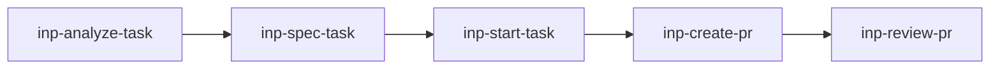

# inp-* 워크플로

`inp-*`는 Innopam의 `TSK-*` 작업을 분석부터 PR 후속 처리까지 단계별로 나눈 스킬 묶음이다. 각 스킬은 같은 안전 원칙을 공유하지만, 허용되는 부작용과 종료 지점이 다르다.

## 한눈에 보는 흐름

1. `inp-analyze-task`: 작업 의미, 범위, 리스크를 읽기 전용으로 해석한다.
2. `inp-spec-task`: 구현 가능한 요구사항과 인수 조건으로 명세를 구체화한다.
3. `inp-start-task`: Notion 상태를 `진행 중`으로 바꾸고 브랜치 또는 워크트리를 준비한 뒤 구현을 시작한다.
4. `inp-create-pr`: 작업 브랜치를 검증하고 최초 PR을 생성하거나 재사용한다.
5. `inp-review-pr`: 리뷰, CI, 후속 수정, merge readiness를 처리한다.

## 공통 계약

- 입력으로 받은 숫자 ID는 `TSK-<number>` 형식으로 정규화한다.
- 작업 식별이 애매하면 짧은 확인 질문 한 번으로 좁힌다.
- 사용자 작업 트리와 관련 없는 변경은 건드리지 않는다.
- `stash`, `reset`, `rebase`, 브랜치 삭제처럼 파괴적인 Git 동작은 명시 승인 없이 하지 않는다.
- Notion, 로컬 task 파일, 코드, PR에 대한 쓰기 권한은 단계별로 다르게 제한된다.

## 단계별 선택 기준

| 상황 | 사용할 스킬 | 읽는 대상 | 쓰는 대상 |
|------|-------------|-----------|-----------|
| 작업이 무엇을 요구하는지 먼저 알고 싶다 | `inp-analyze-task` | Notion, 로컬 task 파일, 저장소 문맥 | 없음 |
| 구현 전에 요구사항과 인수 조건을 고정하고 싶다 | `inp-spec-task` | Notion, 로컬 task 파일, 필요한 저장소 문맥 | 승인 전 없음, 승인 후 Notion 또는 로컬 task 파일 |
| 실제 구현을 시작해야 한다 | `inp-start-task` | Notion, 저장소 README, 규칙 문서 | Notion 상태, 브랜치/워크트리, 경우에 따라 task 카드 |
| 구현이 끝났고 첫 PR을 열어야 한다 | `inp-create-pr` | 브랜치 상태, diff, 커밋, README, 필요 시 task 문맥 | 커밋, push, PR |
| 이미 열린 PR의 리뷰나 CI를 처리해야 한다 | `inp-review-pr` | PR 메타데이터, 리뷰 스레드, 체크 결과, 로컬 상태 | 후속 커밋, push, PR 업데이트 |

## 단계별 종료 지점

### `inp-analyze-task`

- 목적: 작업을 설명 가능한 상태로 만든다.
- 멈추는 지점: 구현 방향, 리스크, 불명확한 점, 추천 다음 단계를 정리하면 끝난다.
- 하지 않는 일: 상태 변경, 브랜치 생성, 코드 수정, PR 조작.

### `inp-spec-task`

- 목적: 작업을 구현 가능한 명세 초안으로 만든다.
- 멈추는 지점: 문제, 목표, 비목표, 요구사항, 인수 조건, 테스트 계획, 가정이 정리되면 끝난다.
- 하지 않는 일: 사용자 승인 전 쓰기, 구현 시작, PR 생성.

### `inp-start-task`

- 목적: 작업을 실제 구현 가능한 작업 상태로 전환한다.
- 멈추는 지점: Notion 상태가 적절히 반영되고, 안전한 브랜치 또는 워크트리가 준비되어 구현이 시작되면 된다.
- 특징: 다섯 스킬 중 유일하게 fallback 스크립트 `scripts/notion_task.py`를 포함한다.

### `inp-create-pr`

- 목적: 구현 결과를 리뷰 가능한 PR로 올린다.
- 멈추는 지점: 검증, 커밋, push, PR 생성 또는 재사용, merge criteria 정리가 끝나면 멈춘다.
- 하지 않는 일: merge.

### `inp-review-pr`

- 목적: 열린 PR을 merge decision 직전까지 끌고 간다.
- 멈추는 지점: 리뷰 코멘트, CI 실패, 보강 검증, 잔여 리스크가 정리되면 끝난다.
- 하지 않는 일: 사용자가 명시하지 않은 merge.

## 자주 갈리는 판단

### analyze와 spec의 차이

- `inp-analyze-task`는 작업을 해석한다.
- `inp-spec-task`는 구현자가 바로 움직일 수 있도록 명세를 고정한다.
- 요구사항이 이미 충분히 구체적이면 analyze를 건너뛰고 spec 또는 start로 갈 수 있다.

### start와 create-pr의 경계

- `inp-start-task`는 구현을 시작하는 단계다.
- `inp-create-pr`는 이미 구현된 변경을 검증하고 리뷰 절차에 올리는 단계다.
- 현재 브랜치가 `main`이거나 task branch가 없으면 create-pr가 아니라 start에 가깝다.

### create-pr와 review-pr의 경계

- PR이 아직 없거나 최초 설명이 비어 있으면 `inp-create-pr`를 쓴다.
- PR이 이미 있고 리뷰, CI, 후속 수정이 남아 있으면 `inp-review-pr`를 쓴다.

## 현재 설계에서 알아둘 점

- Notion fallback은 현재 `inp-start-task`에만 구현돼 있다.
- GitHub Copilot은 이 리포에서 스킬은 받지만 글로벌 지침은 받지 않는다. 도구별 체감 일관성은 다를 수 있다.
- `skills/<name>/agents/codex.yaml`은 모든 inp 스킬에 존재하지만, 현재 문서 기준으로는 family 전체 무결성 검사가 강하게 걸려 있지 않다.

## 관련 문서

- [README.md](../README.md)
- [docs/concepts.md](concepts.md)
- [docs/extending.md](extending.md)
- [docs/platform-mapping.md](platform-mapping.md)
- [skills/inp-analyze-task/SKILL.md](../skills/inp-analyze-task/SKILL.md)
- [skills/inp-spec-task/SKILL.md](../skills/inp-spec-task/SKILL.md)
- [skills/inp-start-task/SKILL.md](../skills/inp-start-task/SKILL.md)
- [skills/inp-create-pr/SKILL.md](../skills/inp-create-pr/SKILL.md)
- [skills/inp-review-pr/SKILL.md](../skills/inp-review-pr/SKILL.md)