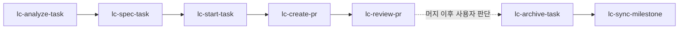

# lc-* 워크플로

`lc-*`는 로컬 `planning/` 문서 기반 작업(`T0xx`)의 생명주기를 분석부터 아카이브까지 단계별로 나눈 스킬 묶음이다. 각 스킬은 같은 안전 원칙을 공유하지만, 허용되는 부작용과 종료 지점이 다르다.

## 한눈에 보는 흐름

1. `lc-analyze-task`: 작업 의미, 범위, 의존성, 리스크를 읽기 전용으로 해석한다.
2. `lc-spec-task`: 구현 가능한 목표·범위·완료 조건·검증으로 명세를 구체화한다.
3. `lc-start-task`: 작업을 `doing`으로 전환하고 브랜치 또는 워크트리를 준비한 뒤 구현을 시작한다.
4. `lc-create-pr`: 작업 브랜치를 검증하고 최초 PR을 생성하거나 재사용한다.
5. `lc-review-pr`: 리뷰, CI, 후속 수정, merge readiness를 처리한다.
6. `lc-archive-task`: 완료된 작업 문서를 `planning/archive/`로 이동한다.
7. `lc-sync-milestone`: 마일스톤·작업 문서와 두 index의 정합성을 검사하고 조정한다.

## 공통 계약

- 작업 출처는 프로젝트 로컬 `planning/` 문서다. Notion, Linear 등 외부 트래커를 사용하지 않는다.
- 진입 순서는 `docs/.agents/planning-guide.md`(존재 시) → `planning/milestones/index.md` → `planning/tasks/index.md`다.
- 입력 ID는 `T<digits>` 형식으로 정규화한다. 마일스톤은 `M<digits>`, 후보는 `MC<digits>`며 ID는 재사용하지 않는다.
- 상태는 `todo`, `doing`, `done`, `blocked`만 사용하며 frontmatter와 `index.md` 현황판을 동기 유지한다.
- 프로젝트 루트에이전트 안내 문서(`AGENTS.md` 등)와 `planning/` 진입점이 모두 없으면 추측하지 않고 중단한다.
- 작업 식별이 애매하면 짧은 확인 질문 한 번으로 좁힌다.
- 사용자 작업 트리와 관련 없는 변경은 건드리지 않는다.
- `stash`, `reset`, `rebase`, 브랜치 삭제, force push처럼 파괴적인 Git 동작은 명시 승인 없이 하지 않는다.
- planning 문서, 코드, PR에 대한 쓰기 권한은 단계별로 다르게 제한된다.
- 리포 자체의 브랜치·커밋·PR·검증 규칙 문서(예: `docs/conventions/`)가 있으면 스킬 기본값보다 그것을 우선한다.

## 단계별 선택 기준

| 상황 | 사용할 스킬 | 읽는 대상 | 쓰는 대상 |
|------|-------------|-----------|-----------|
| 작업이 무엇을 요구하는지 먼저 알고 싶다 | `lc-analyze-task` | planning 문서, 필요한 저장소 문맥 | 없음 |
| 구현 전에 요구사항과 완료 조건을 고정하고 싶다 | `lc-spec-task` | planning 문서, 필요한 저장소 문맥 | 승인 전 없음, 승인 후 planning 문서 |
| 실제 구현을 시작해야 한다 | `lc-start-task` | planning 문서, 저장소 규칙 문서 | task 상태(`todo→doing`), index 행, 브랜치/워크트리 |
| 구현이 끝났고 첫 PR을 열어야 한다 | `lc-create-pr` | 브랜치 상태, diff, 커밋, 필요 시 planning 문맥 | 커밋, push, PR |
| 이미 열린 PR의 리뷰나 CI를 처리해야 한다 | `lc-review-pr` | PR 메타데이터, 리뷰 스레드, 체크 결과, 로컬 상태 | 후속 커밋, push, PR 업데이트 |
| 완료된 작업 문서를 보관하고 싶다 | `lc-archive-task` | planning 문서, index | 승인된 문서 이동(`git mv`) |
| 마일스톤 종료 시 문서와 index를 맞추고 싶다 | `lc-sync-milestone` | planning 전체 | 승인 전 없음, 승인 후 planning 메타데이터만 |

## 단계별 종료 지점

### `lc-analyze-task`

- 목적: 작업을 설명 가능한 상태로 만든다.
- 멈추는 지점: 목적, 범위, 의존성, 리스크, 불명확한 점, 추천 다음 단계를 정리하면 끝난다.
- 하지 않는 일: 상태 변경, 브랜치 생성, 코드 수정, PR 조작, 파일 쓰기 전반.

### `lc-spec-task`

- 목적: 작업을 구현 가능한 명세 초안으로 만든다.
- 멈추는 지점: 목표, 범위, 제외 범위, 완료 조건, 검증, 가정이 정리되면 끝난다.
- 하지 않는 일: 사용자 승인 전 쓰기, `doing` 전환, 구현 시작, PR 생성, 후보 승격.

### `lc-start-task`

- 목적: 작업을 실제 구현 가능한 상태로 전환한다.
- 멈추는 지점: 상태가 `doing`으로 반영되고 안전한 브랜치 또는 워크트리가 준비되어 구현이 진행되면 된다.
- 전제 조건: task가 `todo`, 소속 마일스톤이 활성, `depends_on` 전부 완료. 셋 중 하나라도 어긋나면 중단한다.
- 하지 않는 일: `done` 마일스톤이나 후보(`MC*`) 작업 시작, `done` 표시.

### `lc-create-pr`

- 목적: 구현 결과를 리뷰 가능한 PR로 올린다.
- 멈추는 지점: 검증, 커밋, push, PR 생성 또는 재사용, merge criteria 정리가 끝나면 멈춘다.
- 하지 않는 일: merge.

### `lc-review-pr`

- 목적: 열린 PR을 merge decision 직전까지 끌고 간다.
- 멈추는 지점: 리뷰 코멘트, CI 실패, 보강 검증, 잔여 리스크가 정리되면 끝난다.
- 하지 않는 일: 사용자가 명시하지 않은 merge, task `done` 표시.

### `lc-archive-task`

- 목적: 완료 문서를 `planning/archive/`로 옮겨 활성 트리를 정리한다.
- 멈추는 지점: 승인된 문서를 `git mv`로 이동하고 index 영향을 보고하면 끝난다.
- 하지 않는 일: `done` 아닌 작업 이동, 문서 내용·상태 수정, index 행 자동 정리, 후보 문서 이동.

### `lc-sync-milestone`

- 목적: 마일스톤 종료 전후에 문서와 index의 정합성을 맞춘다.
- 멈추는 지점: ID·상태·링크·의존성·cycle 검사 결과를 보고하고, 승인된 메타데이터 수정을 반영하면 끝난다.
- 하지 않는 일: product code·candidates·generated file 수정, 후보 승격, 마일스톤 임의 `done` 선언.

## 상태 전이 규칙

- `todo → doing`: `lc-start-task`만 수행한다. 마일스톤이 활성이고 의존성이 완료된 작업만 가능하다.
- `doing → done`: 머지 결정은 사용자의 몫이다. 스킬은 자동으로 `done`을 표시하지 않고, 확정은 `lc-sync-milestone`에서 사용자 승인으로 한다.
- `done → archive`: `lc-archive-task`가 문서만 이동한다. 상태 값 자체는 바꾸지 않는다.

## 자주 갈리는 판단

### analyze와 spec의 차이

- `lc-analyze-task`는 작업을 해석한다.
- `lc-spec-task`는 구현자가 바로 움직일 수 있도록 명세를 고정한다.
- 요구사항이 이미 충분히 구체적이면 analyze를 건너뛰고 spec 또는 start로 갈 수 있다.

### start와 create-pr의 경계

- `lc-start-task`는 구현을 시작하는 단계다.
- `lc-create-pr`는 이미 구현된 변경을 검증하고 리뷰 절차에 올리는 단계다.
- task branch가 없거나 상태가 아직 `todo`면 create-pr가 아니라 start에 가깝다.

### create-pr와 review-pr의 경계

- PR이 아직 없거나 최초 설명이 비어 있으면 `lc-create-pr`를 쓴다.
- PR이 이미 있고 리뷰, CI, 후속 수정이 남아 있으면 `lc-review-pr`를 쓴다.

### archive와 sync의 경계

- `lc-archive-task`는 문서 이동이 목적이다. index 행은 기존 패턴대로 보존하고 영향만 보고한다.
- `lc-sync-milestone`은 정합성 검사가 목적이다. 승인 없이 아무것도 고치지 않는다.
- 마일스톤을 마무리할 때는 보통 sync로 정합성을 확인한 뒤 archive로 문서를 옮긴다.

## 현재 설계에서 알아둘 점

- `planning/` 규약은 프로젝트마다 다를 수 있다. 진입점 문서가 없으면 스킬은 조용히 대체 출처를 만들지 않고 중단한다.
- `index.md`의 과거 마일스톤 행은 히스토리로 보존되는 패턴이 있다. archive와 sync는 링크가 아카이브를 가리키게 된다는 이유로 행을 삭제하거나 자동 정규화하지 않는다.
- 후보(`MC*`)는 승격 전까지 구현·아카이브·동기화 대상이 아니다. 승격은 항상 사용자 결정이다.
- `gh`가 필요한 단계(`lc-create-pr`, `lc-review-pr`)는 `gh`가 설치·인증되어 있다고 전제하고 실제 명령을 먼저 실행한다. 실패할 때만 설치·인증·remote 설정 절차를 안내한다.
- 커밋 메시지·PR 제목은 대상 리포의 컨벤션 문서를 우선하며, AI 귀속 트레일러는 사용자가 요청하지 않으면 붙이지 않는다.

## 관련 문서

- [README.md](../README.md)
- [docs/concepts.md](concepts.md)
- [docs/extending.md](extending.md)
- [docs/ntn-workflow.md](ntn-workflow.md)
- [skills/lc-analyze-task/SKILL.md](../skills/lc-analyze-task/SKILL.md)
- [skills/lc-spec-task/SKILL.md](../skills/lc-spec-task/SKILL.md)
- [skills/lc-start-task/SKILL.md](../skills/lc-start-task/SKILL.md)
- [skills/lc-create-pr/SKILL.md](../skills/lc-create-pr/SKILL.md)
- [skills/lc-review-pr/SKILL.md](../skills/lc-review-pr/SKILL.md)
- [skills/lc-archive-task/SKILL.md](../skills/lc-archive-task/SKILL.md)
- [skills/lc-sync-milestone/SKILL.md](../skills/lc-sync-milestone/SKILL.md)
